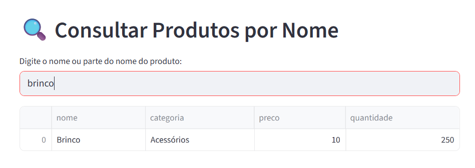
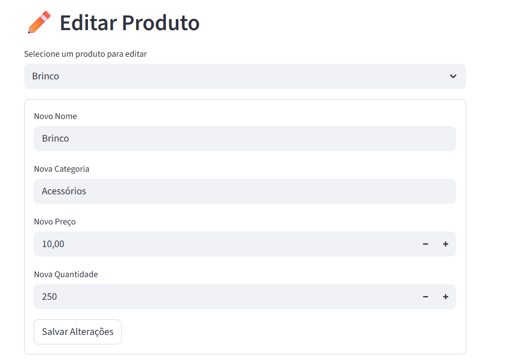
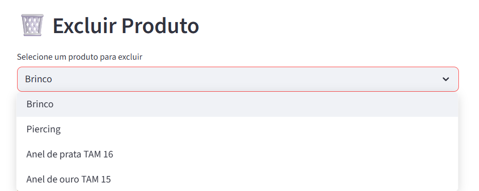
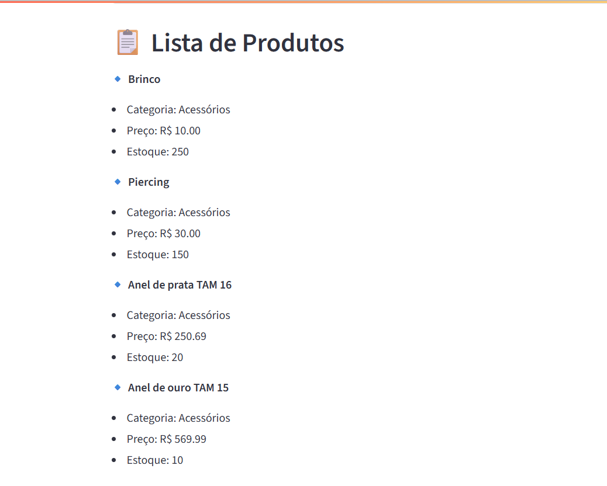
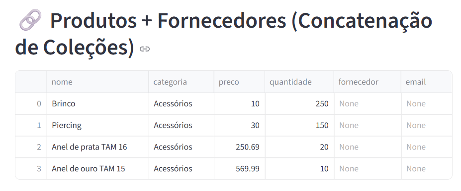

INTRODUÇÃO

A E-Shop Brasil é uma das maiores plataformas de e-commerce do país, com mais de 5 milhões de clientes ativos e cerca de 100 mil pedidos diários. Com o crescimento acelerado, surgiram desafios relacionados à gestão de dados, personalização do atendimento e eficiência logística.

Este projeto propõe uma solução prática usando tecnologias de banco de dados relacional, NoSQL e Big Data para melhorar a segurança das informações, personalizar a experiência do cliente e otimizar a operação da empresa, especialmente em períodos de alta demanda.

# PASSO A PASSO DO TRABALHO

### Preparação do ambiente:

Utilização do Docker para criar um ambiente isolado e padronizado.

Configuração do MongoDB dentro de um container com docker-compose.yml.

# Desenvolvimento da aplicação:

Criação da interface gráfica com Streamlit (app.py).

Implementação das funcionalidades:

Inserir dados no MongoDB.

Listar e consultar dados.

Editar registros individualmente.

Excluir registros de forma individual.

Concatenar dados de diferentes coleções.

# Testes e validação:

Execução local da aplicação para garantir o funcionamento de todas as funcionalidades.

Criação de exemplos visuais com prints da interface, salvos na pasta exemplos/.

# Documentação 

Descrição das funcionalidades da aplicação.

Organização de todos os arquivos no repositório do GitHub.

## Exemplos de Funcionalidadess

### Inserção de Produto

### Consulta de Produtos

### Edição de Produtos

### Exclusão de Produtos

### Listagem de Produtos

### Concatenação de Produtos

